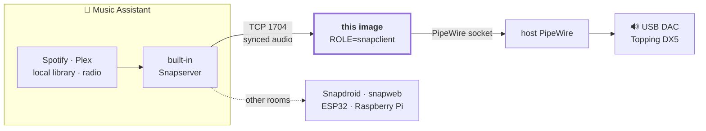

# Snapcast-PipeWire

[](https://github.com/shuricksumy/pipewire-snapclient/actions/workflows/build.yml)

A high-performance, multi-architecture (amd64, arm64) Docker container running Snapcast with native PipeWire support. Optimized for bit-perfect audio delivery to high-end DACs like the Topping DX5.

## 🎯 Why this exists

[**Music Assistant**](https://www.music-assistant.io/) is the library and streaming brain — Spotify, Plex, local files, radio — and Home Assistant drives it. What it cannot do on its own is put audio into a **USB DAC plugged into some other Linux box**, at the original sample rate, in sync with the rest of the house.

Music Assistant solves the "in sync with the rest of the house" half with its
[Snapcast provider](https://www.music-assistant.io/player-support/snapcast/): it ships a built-in
Snapserver and streams synchronised audio to any [Snapcast](https://github.com/snapcast/snapcast)
client on the network.

**This image is the client for the hi-fi end of that chain.** It plays straight into the host's
PipeWire session instead of grabbing an ALSA device, so the DAC follows the source rate
(44.1 kHz stays 44.1 kHz, no resampling), and the volume lands on the real hardware sink.



### Use it with Music Assistant

**The normal way — let Music Assistant be the server.** Add the Snapcast provider in MA
(`Settings → Player Providers → Add → Snapcast`) and leave the built-in server on. Then point this
container at the MA host and nothing else:

```yaml
environment:
  - ROLE=snapclient
  - SERVER_IP=192.168.1.50   # your Music Assistant host
  - SNAP_PORT=1704
  - CLIENT_ID=Lounge-DX5     # the name you will see in Music Assistant
```

The client appears under the Snapcast provider in MA within a few seconds and can be grouped with
your other rooms. Full setup is in [🚀 Deployment](#-deployment-docker-compose).

**The advanced way — run the server here too.** MA can use an external Snapserver instead
(`ROLE=snapserver`), which is what you want when Snapcast, not MA, is the centre of your audio
setup — e.g. LedFx or another producer also writes into the same FIFOs. Three things to know:

| | |
| :-- | :-- |
| **Version** | MA needs snapserver ≥ 0.27.0 and specifically **cannot** use 0.30.0. This image tracks the latest upstream release (0.35.0 today). |
| **Ports** | 1704, 1705 **and the 4953–5153 range** must be reachable — MA creates a stream per player in that range. `network_mode: host` is the simple answer. |
| **Stream name** | MA requires a stream named `default`. [`snapserver.conf`](snapserver.conf) here ships `Default` — rename it if you go this route. |

## Features
- Dual Role Strategy: Use a single image for both snapserver and snapclient.

- Native PipeWire: Built against the with-pipewire Debian package for ultra-low latency and bit-perfect sample rate switching.

- Auto-Bootstrap: Seeds the tuned `snapserver.conf` from this repo into your mounted volume on the first run; your edits win from then on.

- Hardware Control: Unmutes and sets the volume of your DAC on startup via `wpctl` (`INIT_VOL`, `PLAYER_NAME`).

- Self-Healing Client: The client reconnects on its own with exponential backoff (5s → 60s) instead of relying on a container restart, and forwards `docker stop` straight to snapclient.

- Unprivileged: Runs as uid/gid 1000, not root — see [Running unprivileged](#-running-unprivileged).

- Always Current: Snapcast `.deb` packages are fetched from the upstream GitHub release at build time (sha256-verified against the digest GitHub publishes), so a new Snapcast release only needs a rebuild — no binaries committed to this repo.

- Maintained Image: Rebuilt weekly so Debian security updates and new Snapcast releases land without a commit, and scanned with Trivy on every push.

- Healthcheck: Reports unhealthy when the snapcast process for the configured role is gone. Note this tracks the *process*, not the connection — a client retrying against an unreachable server still reports healthy, because it is alive and doing exactly what it should.

> **Note on discovery:** this image does not run `avahi-daemon`, so mDNS/Zeroconf announcement is not available. Point clients at `SERVER_IP` explicitly. (`snapserver` logs a harmless `Avahi: Failed to create client` line at startup.)

## 🛠️ Host Setup (Preparation)

The container does **not** run its own PipeWire daemon — it connects to the host's through the
bind-mounted socket. So the host has to be a working PipeWire machine first: run these steps in
order, then use the [readiness check](#5-verify-the-host-is-ready) at the end before starting any
container.

> **Shortcut:** [`ubuntu-pipewire-install-on-host.sh`](ubuntu-pipewire-install-on-host.sh) performs
> steps 1–5 for a dedicated user, verifies the socket, and prints the compose settings for your
> host: `./ubuntu-pipewire-install-on-host.sh <username>` (default user: `dietpi`).

### 0. Prerequisites

Docker Engine plus the Compose plugin ([install guide](https://docs.docker.com/engine/install/)),
and the uid of the user whose PipeWire session the container will attach to. Note it now — the
same number appears in the socket path *and* in `user:` in your compose file:

```bash
id -u    # usually 1000
```

### 1. Install PipeWire & Tools

```bash
sudo apt update && sudo apt install -y \
    pipewire pipewire-audio pipewire-pulse pipewire-alsa \
    wireplumber alsa-utils rtkit
```

> **Note:** the real-time helper package is `rtkit`, **not** `rtkit-daemon` — no such package
> exists on Debian or Ubuntu, and apt aborts the entire command on one unknown name, so a single
> typo leaves nothing installed. Likewise `pipewire-audio` is the current name of what used to be
> `pipewire-audio-client-libraries`.

### 2. Add your user to the audio groups

`usermod -aG` is all-or-nothing: if **any** listed group does not exist it exits with an error and
adds *none* of them. `bluetooth`, `render`, `pulse-access` and `docker` only exist once their
package is installed, so add whichever are actually present:

```bash
for g in audio video render bluetooth lp docker; do
    getent group "$g" >/dev/null && sudo usermod -aG "$g" "$USER"
done

# Group membership only applies to new sessions -- log out and back in, then verify:
id -nG
```

### 3. Configure Bit-Perfect Output

To allow your DAC to switch sample rates without resampling, create a configuration override for PipeWire:

```bash
mkdir -p ~/.config/pipewire/pipewire.conf.d/
cat <<EOF > ~/.config/pipewire/pipewire.conf.d/bitperfect.conf
context.properties = {
    # Rate used while nothing is playing; PipeWire switches to the source rate on demand
    default.clock.rate          = 48000
    # Trim this list to the rates your DAC actually supports
    default.clock.allowed-rates = [ 44100 48000 88200 96000 176400 192000 352800 384000 ]
    default.clock.min-quantum   = 32
    default.clock.max-quantum   = 8192
}
EOF

systemctl --user restart pipewire pipewire-pulse wireplumber
```

### 4. Keep the audio stack running headless

On a server, the user's PipeWire services only start when that user logs in. Lingering keeps them
up so the DAC is available to the container across reboots and logouts:

```Bash
# 1. Keep this user's services running when nobody is logged in.
#    This is also what makes systemd create and keep /run/user/<uid>/, which is
#    where the socket the container mounts lives.
sudo loginctl enable-linger "$USER"

# 2. Enable and start the audio services for the user session.
#    The '--user' flag is mandatory here.
systemctl --user enable --now pipewire.socket pipewire.service \
    pipewire-pulse.service wireplumber.service

# 3. Verify the services are running
systemctl --user status pipewire wireplumber --no-pager
```

When driving these from a root shell or a cron job rather than your own login session, point the
tools at the right bus first:

```Bash
export XDG_RUNTIME_DIR="/run/user/$(id -u)"
export DBUS_SESSION_BUS_ADDRESS="unix:path=${XDG_RUNTIME_DIR}/bus"
```

### 5. Verify the host is ready

All four of these must pass **before** you start a container — every one of them is something the
container itself cannot fix:

```Bash
# a) The socket the client bind-mounts exists and belongs to you.
#    This exact path goes in the compose 'volumes:' entry.
ls -l /run/user/$(id -u)/pipewire-0

# b) WirePlumber sees your DAC. Note the sink name -- a substring of it is PLAYER_NAME.
wpctl status

# c) The exact node.name for PIPEWIRE_NODE
pw-cli ls Node | grep -E 'node.name|node.description'

# d) Audio actually reaches the DAC (you should hear it)
speaker-test -c 2 -t sine -l 1
```

Then wire the results into your compose file:

| Check | Goes into |
| :-- | :-- |
| `id -u` (e.g. `1000`) | the socket path, plus `user: "<uid>:<gid>"` if it is **not** 1000 |
| socket path from (a) | `volumes: - /run/user/1000/pipewire-0:/tmp/pipewire-0` |
| sink name from (b) | `PLAYER_NAME` (substring is enough) |
| `node.name` from (c) | `PIPEWIRE_NODE` |

Running the **server** role as well? Its bind mounts must be writable by the same uid, otherwise
snapserver cannot create its FIFOs or write its config — Docker creates a missing bind-mount
source as a root-owned directory:

```Bash
mkdir -p ./snapserver_config /tmp/snapfifo
sudo chown -R "$(id -u):$(id -g)" ./snapserver_config /tmp/snapfifo
```

## 🎧 Bluetooth Hi-Fi Playing Guide

### Install the Core Engine

This installs the Bluetooth daemon, the ALSA bridge, and the management utilities.
```Bash
sudo apt-get update
sudo apt-get install bluetooth bluez bluez-tools alsa-utils
```

### Manage Devices (The "Lazy" TUI)

- Install the Go package from [bluetuith-org/bluetuith](https://github.com/bluetuith-org/bluetuith),
  or unpack the prebuilt binary from the [`utils`](utils/) folder:

```Bash
# uname -m reports aarch64, but the tarball is named arm64
case "$(uname -m)" in aarch64) ARCH=arm64 ;; *) ARCH=x86_64 ;; esac
tar -xzf "utils/bluetuith_0.2.6_Linux_${ARCH}.tar.gz" -C /tmp bluetuith
sudo install -m 755 /tmp/bluetuith /usr/local/bin/bluetuith
```

- Instead of complex commands, use the Go-based TUI to scan and pair:
```Bash
# Start the manager
bluetuith
```
- Identify Node Names
Use this to find the Permanent Name of your FiiO, JBL, or Topping DX5:
```Bash
pw-cli ls Node | grep -E 'node.name|node.description'
```

- Set in docker compose your node like
```
- PIPEWIRE_NODE="bluez_output.20_18_12_00_07_C4.1"
```

##  🚀 Deployment (Docker Compose)

Ready-to-edit files live in the repo: [`docker-compose-example.yaml`](docker-compose-example.yaml) (client),
[`docker-compose-server-example.yaml`](docker-compose-server-example.yaml) (server) and
[`docker-compose.yml`](docker-compose.yml) (local build).

### Server Role (The Engine)

This instance manages audio streams and the Web UI.

```yaml
services:
  snapserver:
    image: ghcr.io/shuricksumy/snapcast-pipewire:latest
    container_name: snapserver
    network_mode: host
    environment:
      - ROLE=snapserver
      - SNAP_PORT=1704
    volumes:
      # Must be writable by uid 1000: sudo chown -R 1000:1000 snapserver_config
      - ./snapserver_config:/config
      # Host /tmp/snapfifo becomes the container's /tmp, so the pipe:///tmp/snapfifo
      # sources in snapserver.conf are /tmp/snapfifo/snapfifo* on the host
      - /tmp/snapfifo:/tmp
    restart: unless-stopped
```

### Client Role (The Topping DX5 Node)
This instance connects to the server and outputs to your DAC.

```yaml
services:
  snapclient-dx5:
    image: ghcr.io/shuricksumy/snapcast-pipewire:latest
    container_name: snapclient-dx5
    network_mode: host
    cap_add:
      - SYS_NICE
    ulimits:
      rtprio: 95
      memlock: -1
    group_add:
      - audio
    environment:
      - ROLE=snapclient
      - SERVER_IP=127.0.0.1
      - SNAP_PORT=1704
      - CLIENT_ID=Lounge-DX5
      - PLAYER_NAME=DX5 # part of name like in wpctl status Audio - to set volume
      - INIT_VOL=0.5
      - PIPEWIRE_NODE=alsa_output.usb-Topping_DX5-00.analog-stereo
      - PIPEWIRE_LATENCY=2048/192000
    volumes:
      - /run/user/1000/pipewire-0:/tmp/pipewire-0
      - /dev/shm:/dev/shm
    restart: unless-stopped
```

## 🔒 Running unprivileged

The image runs as **uid/gid 1000** (group `audio`), not root. 1000 is the uid that normally owns
`/run/user/1000/pipewire-0` on a desktop host, which is exactly the socket the client bind-mounts.

- **Host user is not 1000?** Check with `id -u` and pin the container to it: `user: "<uid>:<gid>"`.
- **Server role:** the `/config` bind mount keeps its host ownership, so run
  `sudo chown -R 1000:1000 ./snapserver_config` once. The entrypoint stops with this exact
  instruction rather than failing halfway if the directory is not writable.
- Real-time scheduling still works: `cap_add: SYS_NICE` plus the `rtprio`/`memlock` ulimits are
  granted to the process regardless of the uid.

## ⚙️ Configuration Variables

| Variable | Default | Description |
| :-- | :-- | :-- |
|ROLE|snapclient|Set to ```snapserver``` or ```snapclient```|
|SNAP_PORT|1704|The TCP streaming port. Ignored if `SERVER_IP` already carries a port.|
|SERVER_IP|127.0.0.1|(Client only) Snapserver address. Accepts `host`, `host:port` or `tcp://host:port`.|
|CLIENT_ID|Snap-Node|(Client only) Name appearing in the Web UI (`--hostID`).|
|PLAYER_NAME|_(empty)_|(Client only) Substring of the sink name in `wpctl status`; picks which sink gets `INIT_VOL`. Empty = default sink.|
|INIT_VOL|1.0|(Client only) Volume set once at startup, 0.0–1.0. The sink is also unmuted.|
|PIPEWIRE_NODE|_(empty)_|(Client only) Target `node.name` from `pw-cli ls Node`. Empty = default sink.|
|PIPEWIRE_LATENCY|2048/192000|Buffer size / sample rate hint passed to PipeWire.|
|USE_ALSA|false|(Client only) `true` routes through the ALSA→PipeWire bridge (handles dynamic sample rates, adds latency).|
|SNAP_EXTRA|_(empty)_|(Client only) Extra arguments appended to the `snapclient` command line.|
|EXTRA_ARGS|_(empty)_|(Server only) Extra arguments appended to the `snapserver` command line.|
|DEBUG|false|`true` enables `set -x` tracing in the entrypoint.|

## 🏗️ Build Requirements

The Snapcast packages are **downloaded from the upstream GitHub release during the build** —
nothing needs to be committed to this repo. Stage 0 of the Dockerfile resolves the release, picks
the `_<arch>_trixie_with-pipewire.deb` asset for the target architecture, and verifies each
download against the sha256 digest the GitHub API publishes for it. A missing asset, a missing
digest or a checksum mismatch fails the build.

The runtime stage then asserts that the installed binaries resolve all their shared libraries and
that `snapclient` is really linked against `libpipewire` — a stock distro package would install
fine and then reject `--player pipewire` only at runtime.

| Build arg | Default | Purpose |
| :-- | :-- | :-- |
|SNAPCAST_VERSION|latest|Release tag to install, e.g. `v0.35.0`. `latest` resolves the newest published release at build time; CI pins the tag it resolved so the layer caches.|
|SNAPCAST_SUITE|trixie|Debian suite variant of the release asset (`trixie`, `bookworm`, `bullseye`).|
|REFRESH_WEEK|0|Cache epoch. CI sets it to the ISO week so the weekly scheduled rebuild really re-runs `apt-get upgrade` instead of restoring a stale layer.|

Build Command:

```Bash
docker buildx build --platform linux/amd64,linux/arm64 -t snapcast-pipewire .

# Reproducible build against a specific release:
docker buildx build --build-arg SNAPCAST_VERSION=v0.35.0 -t snapcast-pipewire .
```